# Microglia Morphology Analysis ImageJ Plugin

---

## Table of Contents
1. [Installation and Dependencies](#installation-and-dependencies)
2. [Step 1: Setting up Folder Structures](#step-1-setting-up-folder-structures)
3. [Image Stack Processing: Motion Artefact Removal and Cleaning](#image-stack-processing-motion-artefact-removal-and-cleaning)
    1. [Step 2: Running Stack Preprocessing](#step-2-running-stack-preprocessing)
    2. [Step 3: Running Stack QA](#step-3-running-stack-qa)
        1. [Optional: Manual Processing](#step-3a-optional-manually-processing-stacks-that-were-rejected-from-qa)
        2. [Optional: QA Manually Processed Stacks](#step-3b-optional-qa-manually-processed-stacks)
4. [Automated Cell Detection](#automated-cell-detection)
    1. [Step 4: Cell Detection](#step-4-cell-detection)
    2. [Step 5: Mask Generation](#step-5-mask-generation)
    3. [Step 6: Mask QA](#step-6-mask-qa)
5. [Cell Quantification](#cell-quantification)
    1. [Step 7: Mask Quantification](#step-7-mask-quantification)
    2. [Step 8: Fractal Analysis](#step-8-fractal-analysis)
6. [Next Steps](#next-steps)

---

## Installation and Dependencies

---

This plugin was written to be applied to *in vivo* images of fluorescent microglia obtained in awake mice on a two photon microscope, but in theory can be run on any single channel 3D image stacks of cells with clearly labelled soma and processes.

Running the Microglia Morphology Analysis ImageJ script / plugin requires the installation of:
- [Fiji](https://imagej.net/Fiji)
- [FeatureJ](https://imagej.net/FeatureJ) 
- [MultiStackReg](http://bradbusse.net/sciencedownloads.html)
- [TurboReg](http://bigwww.epfl.ch/thevenaz/turboreg/) (drop the .jar file included in the distribution into your Fiji plugins folder)
- [FracLac](https://imagej.nih.gov/ij/plugins/fraclac/fraclac.html)
- [Stack Contrast Adjustment](https://imagej.nih.gov/ij/plugins/stack-contrast/index.htm)
- [SNT](https://github.com/morphonets/SNT) (including extra SciView functionality)
- [Jython](https://imagej.nih.gov/ij/plugins/jython/) (download the .jar file and place it in a '/jars' folder in your Fiji plugins folder if it isn't already present)

To install the Microglia Morphology Analysis plugin, download the [.jar](https://github.com/BrainEnergyLab/Inflammation-Index/blob/master/Microglia%20Morphology%20Analysis%20Plugin%20-%20ImageJ/microglia-morphology-analysis-0.1.0.jar) file from this GitHub repo  and drop it into your Fiji plugins folder. In addition, download the [Microglia_Morphology_Analysis_Plugin_Sholl_Analysis_Script.py](https://github.com/BrainEnergyLab/Inflammation-Index/blob/master/Microglia%20Morphology%20Analysis%20Plugin%20-%20ImageJ/Microglia_Morphology_Analysis_Plugin_Sholl_Analysis_Script.py) script and drop it into the 'Scripts' folder in your Fiji plugins folder.

**Plugin .jar file location:**

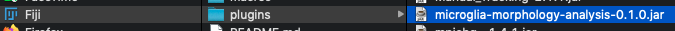

**Plugin .py file location:**

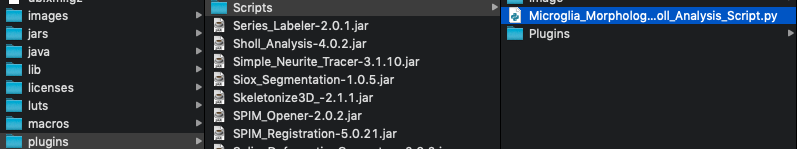

### Example Data

You can find a directory containing the same image and folder structure as outlined below and download it yourself to follow along with the instructions [here](https://drive.google.com/drive/folders/1VMOFgOPVprHUprkT3vY1xapOxIaUK-8w?usp=sharing).

A version of this folder that contains all the files generated once the plugin has been run to completion can be found [here](https://drive.google.com/drive/folders/1t96nDcn9MJm0WcCDIAtmUL9dnJo-L4Ar?usp=sharing).

## Step 1: Setting Up Folder Structures

---

### Raw Image Storage

To begin with, image stacks should be stored in a folder structure as follows:

**Parent Directory -> Animal Name -> Treatment Name -> Image File**

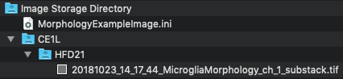

In the above image for example:
- Parent Directory: 'Image Storage Directory'
- Animal Name: 'CE1L'
- Treatment Name: 'HFD21'
- Image File: '20181023...'

In addition a text file containing the calibration information for the images in this parent directory should be saved in the parent directory with the '.ini' file extension. This file should contain the strings:
- "x.pixel.sz = "
- "y.pixel.sz = "
    - X and Y pixel size refer to the X and Y pixel sizes in microns
- "z.spacing = "
    - Z spacing refers to the size of voxels in Z in microns
- "no.of.planes = "
    - Number of planes refers to the number of unique Z planes in the image stack
- "frames.per.plane = " 
    - Frames per plane refers to how many frames were collected at each Z plane

These strings should be followed by their associated numeric values.

For example, a stack of 606 frames in total, with 101 unique Z planes, would have 6 frames per plane.

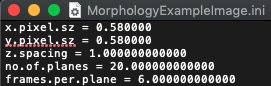

### Working Folder Structure

In addition you need to have an empty folder where the plugin can save all its outputs. This can be any empty folder. For example, here we will be using the 'Working Directory' folder.

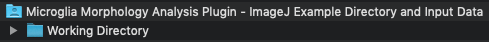

---

## Image Stack Processing: Motion Artefact Removal and Cleaning

This aspect of the pipeline covers two modules in the plugin menu:
- Stack Preprocessing
- Stack QA

These modules are used to process and clean 3D image stacks so that they are suitable for use with the cell detection and quantification modules later in the pipeline.

---

## Step 2: Running Stack Preprocessing

---

[***Video demonstration***](https://github.com/BrainEnergyLab/Inflammation-Index/blob/master/Microglia%20Morphology%20Analysis%20Example%20Videos/stack_preprocessing_movie_480p.mov)

The first step in the image processing pipeline is stack preprocessing. This can be accessed in the 'Microglia Morphology Analysis Plugin' menu option within the Fiji 'Plugins' menu.

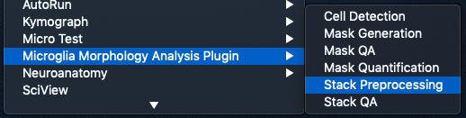

You will then be prompted to select the image storage and working directories that you set up in step 1.

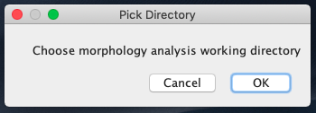

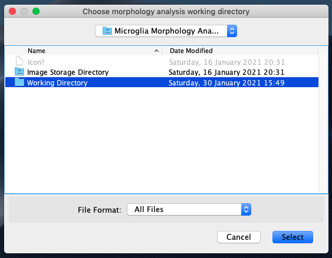

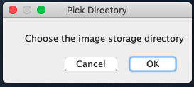

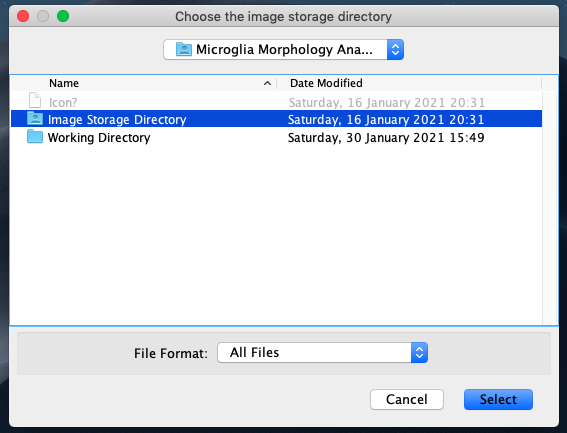

### User Inputs

When selecting this first option, the user will be asked for a number of inputs.

- How many of the 'best' frames per Z plane do you want to include in the final Z plane image?

This is an integer value with the default set to 1. This value determines how many of the least motion-contaminated frames the script will average over to create a final single frame for each Z plane. If 1, rather than averaging frames, the least contamined frame is smoothed using a median filter. This value cannot be 0, and cannot more than the number of frames per Z plane.

- How many frames do you want to include in the average projection of least blurry frames per Z plane?

In order to identify the least motion-contaminated frames described above, the plugin first uses a blur detector to choose the least blurry frames to average over to create a reference frame. All the frames for that Z plane are then compared to this reference frame and the frames that are least different to this reference frame are identified as the least motion-contaminated.

This user input chooses the number of least blurry frames to use to create the reference frame. This input requires an integer value and defaults to 3. Setting this to half the number of frames per Z plane is a good rule of thumb. This value cannot be 0, and cannot more than the number of frames per Z plane.

- If you have already run the 'Stack QA' module, do you want to manually select frames to keep from images that failed automated selection QA in this run?

For image stacks that have already been processed and QA'd (the subsequent step in the pipeline) and failed QA, if checked the plugin will present these stacks to the user so they can manually select the least motion-contaminated frames to retain for each Z plane. These will then be recompiled into a final Z stack and this will be available for QA in the stack QA step.

- What string should we search for in the Image Storage directory to find stacks to process?

This is a string value that indicates which string identifier to use to identify images to process. This can be useful if you only want to process a subset of the images in your Image Storage directory and this subset can be identified by a unique string. It cannot be empty and defaults to "Morphology".

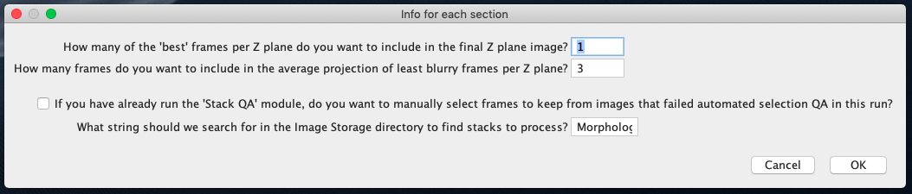

### Outputs

For each image processed, a new folder with a name created by concatenating the Animal name, Treatment name, and 'string to search for', is created in the 'Output' folder in the working directory. This folder contains the processed stack for that image.

In addition, a copy of the raw image is saved in the 'Done' folder in the working directory.

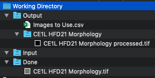

Finally, an 'Images to Use' csv file is saved in the 'Output' folder. This file has a row for each image processed, an indicates if the image has been automatically processed, if this automatically processed version passed QA (in the next step), if the image has been manually processed, and if this manually processed version passed QA (in the next step). In this file values of 1 represent 'Yes', values of 0 represent 'No', and a value of -1 means 'null' i.e. for the QA values, -1 means we haven't run a QA step for the image.

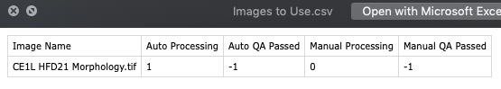

After running this step on a stack for the first time, 'Auto Processing' will have a value of 1. If an automatically processed image does not pass QA in the next step, when the user manually processes it in this step again, its 'Manual Processing' value is changed to 1.

## Step 3: Running Stack QA

---

[***Video demonstration***](https://github.com/BrainEnergyLab/Inflammation-Index/blob/master/Microglia%20Morphology%20Analysis%20Example%20Videos/stack_qa_movie_480p.mov)

The next step in the pipeline is to QA the processed substacks.

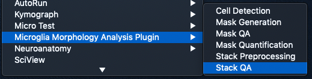

### User Inputs

When selecting to run this step, users are asked for some inputs:

- How many images do you want to display on the screen at once?

Here users can specify how many images they want to display on the screen at once for them to visually inspect. This needs to be an integer value and to be greater than 0. The value defaults to 1.

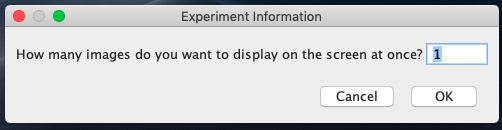

Users are then asked to select the 'working directory' and 'image storage directory' as they were in the previous step.

After providing these inputs, the plugin displays the number of processed stacks the user indicated and prompts the user to 'close the images that aren't good enough in terms of registration for analysis then press ok'.

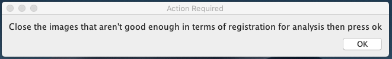

The plugin proceeds in this manner until it has obtained user inputs (i.e. was the image closed or not closed) for all available processed images.

### Outputs

Whether the user has closed an image or not updates its values in the 'Images to Use.csv' file created in the previous step. In each case:

- If an image was the result of automated processing steps:
    - ... and it was not closed in this step:
        - This stack is cleared for use in the next steps
        - The value of 'Auto QA Passed' in 'Images to Use.csv' is set to 1  
    - ... and it was closed in this step:
        - The copy of the input stack in the 'Done' folder is moved back into the 'Input' folder and the 
        - The value of 'Auto QA Passed' in 'Images to Use.csv' is set to 0

In this second case, users can then run Step 1 again and tick the 'If you have already run the 'Stack QA' module, do you want to manually select frames to keep from images that failed automated selection QA in this run?' option when asked for user inputs. This will then prompt the user to manually select the best frames to retain from the image. Output images that have been manually processed can then be run through this 'Stack QA' section and now:

- If an image was the result of manual processing:
    - ... and it was not closed in this step:
        - This stack is cleared for use in the next steps
        - The value of 'Manual QA Passed' in 'Images to Use.csv' is set to 1  
    - ... and it was closed in this step:
        - This stack is now ignored for all future steps 
        - The value of 'Manual QA Passed' in 'Images to Use.csv' is set to 0

## Step 3A (Optional): Manually Processing Stacks That Were Rejected from QA

---

If an automatically processed image is rejected in the previous step, we can run Step 2 again (Stack preprocessing) and this time manually select the frames to keep.

### User Inputs

After selecting the 'working directory' and 'image storage directory' as in previous steops, the key input that needs to be ticked to manually process stacks is:

- If you have already run the 'Stack QA' module, do you want to manually select frames to keep from images that failed automated selection QA in this run?

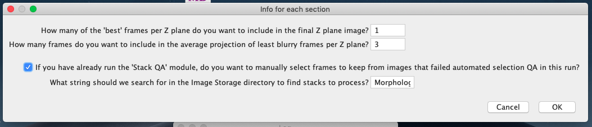

The other relevant user input for manually processing is:

- How many of the 'best' frames per Z plane do you want to include in the final Z plane image?

Whilst for automated processing this value decides how many frames per Z plane to retain based on motion detection steps, for manual processing this value decides how many frames per Z plane users must manually select to keep to average over into a cleaned version of that Z plane.

If the manual processing option is ticked, the plugin will then cycle the image stacks that have been flagged for manually processing and loops through each Z plane in the image stack and presents all the frames from that Z plane in a substack. The user is then prompted to:

- Scroll onto the frame to retain and click 'OK' 

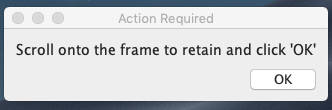

Users must select the required number of frames for each Z plane for all Z planes in the stack. Once this is done, these chosen frames are compiled into an output stack.

### Outputs

The outputs are virtually the same as in Step 2. However, an additional file: 'Slices to Use.csv' is saved in the approriate images subfolder in the 'Output' folder. This file stores the number of the frame/s at each Z plane the user chose to retain. 0's indicate the frame was not chosen, whilst a non-zero number indicates the frame number that was chosen at it's associated Z plane. In additional, image stacks that have been manually processed have their 'Manual Processing' value in the 'Images to Use.csv' file is set to 1.

## Step 3B (Optional): QA Manually Processed Stacks

---

After manually processing images, the 'Stack QA' step can be run again where users will now be presented with the manually processed stacks to approve. As stated previously:

- If an image was the result of manual processing:
    - ... and it was not closed in this step:
        - This stack is cleared for use in the next steps
        - The value of 'Manual QA Passed' in 'Images to Use.csv' is set to 1  
    - ... and it was closed in this step:
        - This stack is now ignored for all future steps 
        - The value of 'Manual QA Passed' in 'Images to Use.csv' is set to 0

---

## Automated Cell Detection

This aspect of the pipeline covers three modules in the plugin menu:
- Cell Detection
- Mask Generation
- Mask QA

These modules are used to semi-automatically detect and segment cells in the image stacks so they can be quantified in the final part of this pipeline.

---

## Step 4: Cell Detection

---

[***Video demonstration***](https://github.com/BrainEnergyLab/Inflammation-Index/blob/master/Microglia%20Morphology%20Analysis%20Example%20Videos/cell_detection_movie_480p.mov)

This module automatically detects cells in the image stacks, but allows for users to either select cells manually, or manually edit the automatic cell selections

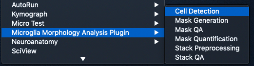

### User Inputs

As in previous steps, users are prompted to select their 'working directory' and 'image storage directory'.

Following this, they are asked:

- What size buffer in um to use to seperate substacks?

This value is used to ensure that when the image stack is split into multiple substacks, the cells in each substack are adequately seperated so that single cells are not represented more than once (i.e. present in multiple substacks). E.g. for a 50um deep stack we want to cut it up into multiple 10um substacks. We take the first 10 microns (0-10) and turn this into a substack. We then leave a buffer (the user indicated value) and then take the next 10 um. E.g. if the buffer is 10 um, we will create a 20-30 um substack from the input image. Etc.

This value needs to be an integer and defaults to 10.

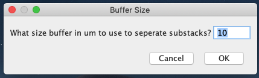

For each substack created, we average project it and display this to the user with the automated cell location detection overlaid and the user is prompted to 'check that the automated CP selection has worked'. 

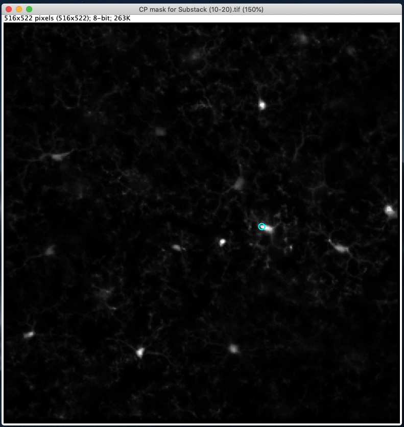

Here we see the automated cell detection has identified a cell location where the cyan circle ROI is drawn.

Once users click 'ok', they are asked 'Automated CPs Acceptable?'. 

**In this context, 'acceptable' means the cell detection has detected the soma of at least one cell accurately. If we have detected no cells, or the detection has highlighted a region of the image that is not cell soma, the detection is unacceptable**

**If users indicate that the automated cell detection has worked:**

Users are then prompted to 'click on cells that were missed by automated detection, if any, and click 'ok' when done'. 

At this point, after clicking on cells missed by the automated detection process and then clicking 'ok', these cell locations are saved and users are presented with the next substack projection, and so on until cell detection is complete. Users should click on the soma of cells in the image.

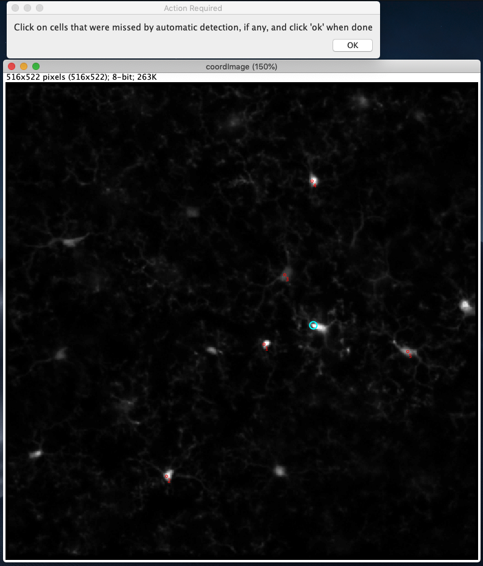

Here you can see we have indicated cells manually where the red circular ROIs are drawn.

**If users indicate that the automated cell detection has not worked:**

Users are then prompted to 'check what's wrong with the automated CP generation'. Once they have determined if the incorrect cell detection is due to their poor image quality, or poor detection, they can click 'ok' and indicate which of these reasons apply.

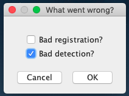

If users indicate that the problem is bad registration, this substack is flagged as failing 'QC' and ignored for all future steps. If users indicate that the only problem is poor detection, they are prompted to 'click on cells to select for analysis, if any, and click 'ok' when done'. Here users can manually indicate cells on the image, and when done the locations of these cells will be saved. Users should click on the soma of cells in the image.

### Outputs

This module creates multiple outputs.

1. 'Mask Generation Status.csv'
    - This file is saved in the 'Output' folder and indicates for each image, how many substacks we can make of that image (based on the user defined buffer) and how many substacks have been made for that image. This is so that if the user exits the 'Cell Detection' module midway, we know where to pick up from in terms of substack generation.

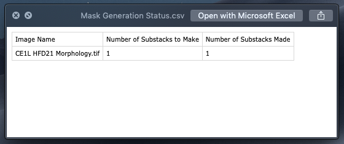

2. 'Cell Coordinates/CP Coordinates for Substack (xx-xx).csv'
    - This file is generated for each substack in an image, and is stored in that image's 'Cell Coordinates' folder. This file contains the X and Y coordinates for each cell location detected / added, as well as columns for the 'optimal' X and Y coordinates for each cell, and the 'optimal' threshold for each cell. These optimal values are described in further detail in the next step.

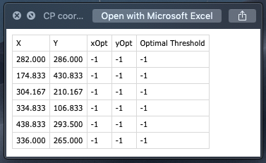

3. 'Cell Coordinate Masks/CP mask for Substack (xx-xx).tif'
    - This is the average projection of the substack saved for each substack in the image's folder, within the 'Cell Coordinate Masks' folder.

3. 'Cell Coordinate Masks/Cell Position Marking.csv'
    - This file stores, for each substack, whether it has been 'Processed' i.e. if it has had cell locations generated / edited, and whetheris has been 'QC'd' i.e. whether these detected cell locations have gone through user approval. This file is created for each substack for each image in the image's 'Cell Coordinate Masks' folder.
        - For images that users reject for 'bad registration', the QC value is set to 0, else it is set to 1.

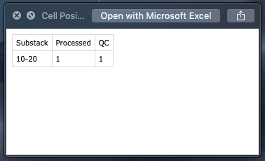

---

## Step 5: Mask Generation

---

[***Video demonstration***](https://github.com/BrainEnergyLab/Inflammation-Index/blob/master/Microglia%20Morphology%20Analysis%20Example%20Videos/mask_generation_movie_480p.mov)

This module uses iterative thresholding to generate cell masks that are then subjected to analysis.

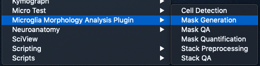

### User Inputs

After selecting the 'working directory' and 'image storage directory' users are prompted for multiple inputs:

In this section the user is asked for a number of inputs:

1. What mask size would you like to use as a lower limit?
2. What mask size would you like to use as an upper limit?
3. What range would you like to use for mask size error?
4. What increment would you like to increase mask size by per loop?
5. What area should the local region around each cell location be? (in um)

inputs.png)

The first two inputs dictate what values the module loops from, and to, whilst the Fourth input indicates the step size each iteration takes. For example, a lower limit of 200, an upper limit of 800, and an increment of 100, would result in us generating segmented cells for mask size values of: 200,300,400,500,600,700,800.

The third input dictates what the error for segment mask size is allowed to be. E.g. if we're creating masks for a mask size of 400 with an error of 100, a mask will be accepted if the area it encompasses is within 300-500.

The fifth input allows users to customise the size of the 'local region' that we draw around each cell location. This defaults to 120 um.

### Outputs

For each mask size value attempted, a corresponding folder is created in the image's folder. In addition, for each substack (e.g. 10-20 um of the input image, 30-40 um of the input image) as 'TCS Status Substack(xx-xx).csv' is created that has a row for each mask size or for that image. Each row has a value for whether masks have been generated for that size (Masks Generated), whether those masks have been subjected to QC (QC Checked) and whether those masks have been analysed (Analysed).

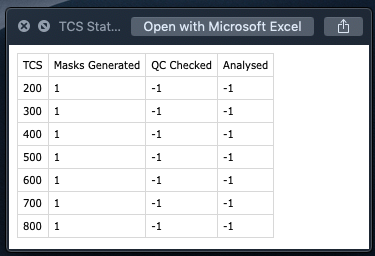

Within each mask size folder is a 'Substack(xx-xx) Mask Generation.csv' file for each substack created. This file contains a row for each cell a mask was generated for, and an indicator for if mask generation was attempted (Mask Try), if it was successful (Mask Success), if that mask has passed QA (MAsk QA) and if that mask has been quantified (Mask Quantified).

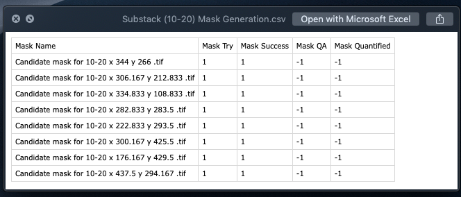

In addition, within the 'Cell Masks' folder, the automatically generated cell masks for that mask size are saved. These images are binary masks.

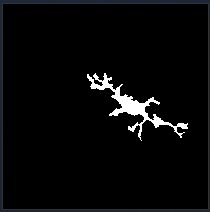

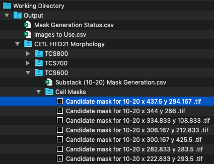

Finally, a 'Local Regions' folder is created in the image's folder where we save the local regions that are centered around our cell coordinates. These are the images that are used to generate the masks saved in the 'Cell Masks' folder.

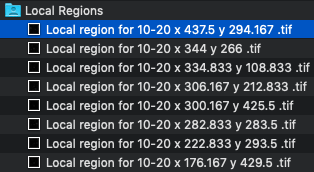

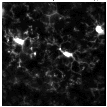

---

## Step 6: Mask QA

---

[***Video demonstration***](https://github.com/BrainEnergyLab/Inflammation-Index/blob/master/Microglia%20Morphology%20Analysis%20Example%20Videos/mask_qa_movie_480p.mov)

In this module users are presented with each automatically generated cell mask, as well as an automatically generated outline of the soma for each cell, which they either reject (if the cell mask encompasses two cells for example) or approve. 

### User Inputs

After selecting the 'working directory' and 'image storage directory' each automatically generated mask will be presented to the user with a prompt to 'Check image for issues'. Each mask is presented as an overlay of the outline of the mask ontop of the local region image. 

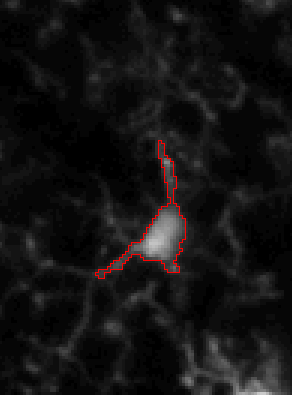

**There is a known issue with masks being displayed in this module where the overlay of the cell mask outline appears to show spurious connecting lines between points. This has no effect on the outcome of the plugin so can be safely ignored, but a resolution is being worked on. In cases where it appears truly artefactual, users should reject the mask.**

Once users have done so and clicked 'ok' they are asked if they want to keep the image. If they keep the image, it is flagged as approved for quantification. If they reject the image, it is ignored for quantification.

If approved, and if no soma mask has been generated for these cell coordinates, this will be generated for the user to approve, along with the prompt 'Check image soma mask'. Once users click 'ok' they can indicate if they want to keep the soma mask. If they do, it is saved.

**There is a known issue with soma mask generation where at times the entire FOV will be selected as the soma mask. Users need to be aware of this and ensure they reject these masks and draw their own manually. A resolution is being worked on.**

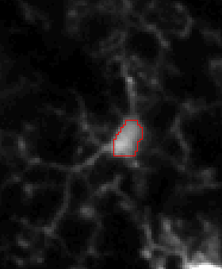

If users reject the automated soma mask, or if one cannot be generated, users will be shown the prompt 'Need to draw manual soma mask'. Once they have clicked 'ok' they must click on the image to draw a ROI around the cell soma. Once done, they must click 'ok' on the prompt 'Draw appropriate soma mask, click 'ok' when done'.

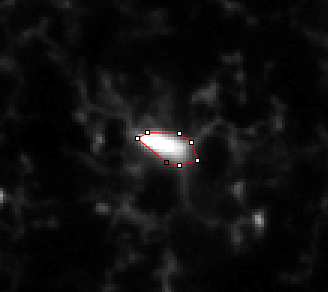

Once the soma mask for a particular cell has either been approved (if automatically generated) or drawn manually, that soma mask is approved for use across all mask sizes (as the mask size does not influence the soma mask that is generated or drawn).

Users proceed to do this for all generated cell masks across all mask sizes.

### Outputs

Within each mask size folder, the 'Substack (xx-xx) Mask Generation.csv' file is updated with information on what cells passed or failed QA.

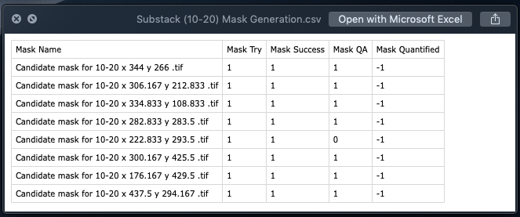

In addition, the 'TCS Status Substack(xx-xx).csv' file for each substack is updated with whether QA has been completed for each of the mask sizes.

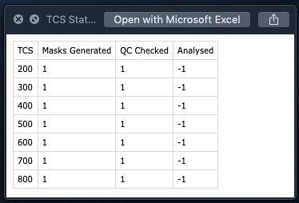

Finally, soma masks are saved in the 'Somas' folder for each cell coordinate.

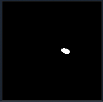

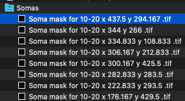

---

## Cell Quantification

This aspect of the pipeline covers one module in the plugin menu:
- Mask Quantification

This module automatically quantifies the approved cell masks generated by the previous pipeline steps.

In addition, users need to manually run the FracLac plugin to perform the fractal analysis.

---

## Step 7: Mask Quantification

---

[***Video demonstration***](https://github.com/BrainEnergyLab/Inflammation-Index/blob/master/Microglia%20Morphology%20Analysis%20Example%20Videos/mask_quantification_movie_480p.mov)

This module iterates through all the approved masks and quantifies them.

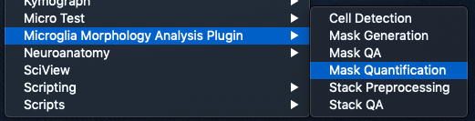

### User Inputs

The only inputs required for this step are for users to indicate where the 'working directory' and 'image storage directory' are.

### Outputs

Within each mask size folder, the 'Substack(xx-xx) Mask Generation.csv' file is updated to indicate which masks have been quantified. Masks that did not pass QA are not quantified. In addition, the 'TCS Status Substack(xx-xx).csv' file is updated to reflect which mask sizes have finished being quantified.

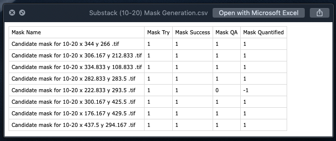

In addition, a 'Results' folder is created for each mask size. In this results folder a number of different file types are saved:

- 'Skeleton Candidate mask for xx-xx... .tif'
    - These files save the skeletonised version of the mask that was quantified so users can inspect whether the skeletonisation worked as intended.

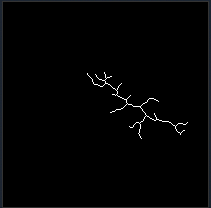

- 'Sholl SL Candidate mask for ... .tif'
    - This is a Semi-log sholl analysis plot for users to inspect

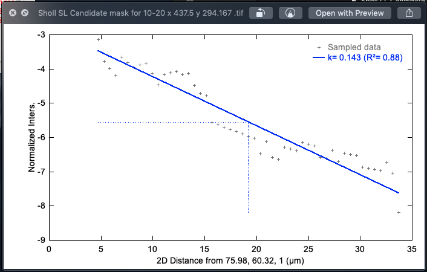

- 'Sholl LL Candidate mask for ... .tif'
    - This is a Log-log sholl analysis plot for users to inspect

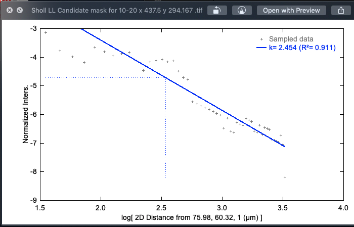

- 'Sholl Fit Candidate mask for ... .tif'
    - This is a linear sholl plot for users to inspect, with the best fit polynomial (if applicable) included.

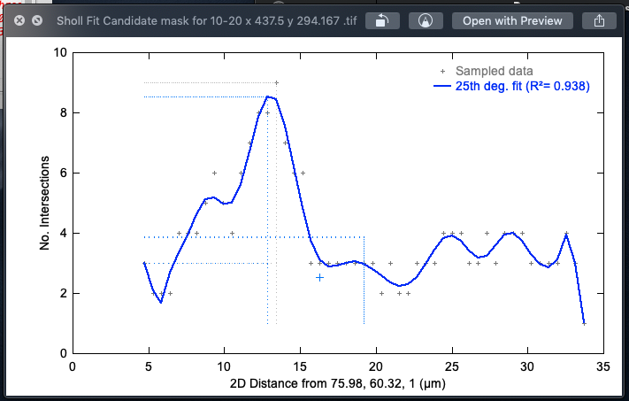

- 'Sholl Mask Candidate mask ... .tif'
    - This is a colour coded overlay of the the cell mask where the colours indicate the number of branches at increasing distances from the cell soma (represented by a black circle)

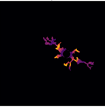

- 'Sholl Candidate mask for ... .csv'
    - This is a results file containing all the sholl related paramters that were measured for the cell.

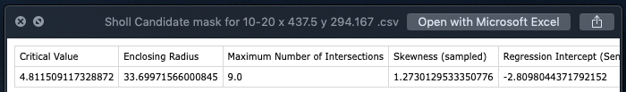

- 'Cell Spread Candidate mask ... .tif'
    - This is an image with lines connecting the cell centre of mass to its four extrema. The length of these lines are averaged to calculate the cell spread value. This plot allows users to inspect the cell spread calculations for each cell.

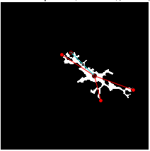

- 'Cell Parameters Candidate mask ... .csv'
    - This is the results file containing all the non-sholl metrics calculated for each cell.

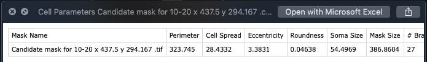

---

## Step 8: Fractal Analysis

---

[***Video demonstration***](https://github.com/BrainEnergyLab/Inflammation-Index/blob/master/Microglia%20Morphology%20Analysis%20Example%20Videos/fraclac_movie_480p.mov)

This final step needs to be run manually. As part of step 7, all the cell masks are copied into a new folder in the 'Output' folder called 'fracLac'. The files are saved with their parent image names and mask size values included. 

#### FracLac Settings and Directions

Users should select the FracLac plugin within the Plugins -> Fractal Analysis menu in Fiji.

They should then select the "BC" button and indicate they do not wish to use legacy mode if prompted. 

In the 'FILES' card users should tick the 'results' box. In the 'GRAPHICS OPTIONS' card users should tick the 'metrics' box to the right of the 'HULL AND CIRCLE' textbox. Following this, users should click 'ok'. If prompted, users should select 'Db' as the fractal to colour code.

Users should then click on 'Batch' and select the fracLac folder in the working directory -> output folder as this is where results will be saved. 

If asked about using the ROI manager, select cancel. In the next dialog box "select files to analyse", highlight all the files you wish to analyse. These are also located in the 'fracLac' folder.

On the next folder selection window, again select the fracLac folder. The fractal analysis is then run on the images you selected and saved in a new folder within the 'fraclac' folder that is named after the date the timestamp the plugin was run. When complete a dialog box will alert users to completion.

## Next Steps

Following on from completing the use of this Fiji plugin, users can use the R package 'Inflammation-Index', also located in this repo, to analyse the outputs. See directions [here](https://github.com/BrainEnergyLab/Inflammation-Index/blob/master/Using%20the%20R%20Inflammation-Index%20Package.md)
