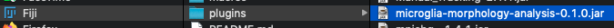

# Microglia Morphology Analysis ImageJ Plugin

## Installation and Dependencies

This plugin was written to be applied to *in vivo* images of fluorescent microglia obtained in awake mice on a two photon microscope, but in theory can be run on any single channel 3D image stacks of cells with clearly labelled soma and processes.

Running the Microglia Morphology Analysis ImageJ script / plugin requires the installation of:
- [Fiji](https://imagej.net/Fiji)
- [FeatureJ](https://imagej.net/FeatureJ) 
- [MultiStackReg](http://bradbusse.net/sciencedownloads.html)
- [TurboReg](http://bigwww.epfl.ch/thevenaz/turboreg/) (drop the .jar file included in the distribution into your Fiji plugins folder)
- [FracLac](https://imagej.nih.gov/ij/plugins/fraclac/fraclac.html)
- [Stack Contrast Adjustment](https://imagej.nih.gov/ij/plugins/stack-contrast/index.htm)
- [SNT](https://github.com/morphonets/SNT) (including extra SciView functionality)
- [Jython](https://imagej.nih.gov/ij/plugins/jython/) (download the .jar file and place it in a '/jars' folder in your Fiji plugins folder if it isn't already present)

To install the Microglia Morphology Analysis plugin, download the [.jar](https://github.com/BrainEnergyLab/Inflammation-Index/blob/master/Microglia%20Morphology%20Analysis%20Plugin%20-%20ImageJ/microglia-morphology-analysis-0.1.0.jar) file from this GitHub repo  and drop it into your Fiji plugins folder. In addition, download the [Microglia_Morphology_Analysis_Plugin_Sholl_Analysis_Script.py](https://github.com/BrainEnergyLab/Inflammation-Index/blob/master/Microglia%20Morphology%20Analysis%20Plugin%20-%20ImageJ/Microglia_Morphology_Analysis_Plugin_Sholl_Analysis_Script.py) script and drop it into the 'Scripts' folder in your Fiji plugins folder.

Example directory and image here:
https://drive.google.com/drive/folders/1e3qkTAhBBKOFFnTt9iWhM7Jtzr2GXH6o?usp=sharing

## Step 1: Raw Image Storage Folder Structure

To begin with, single channel 3D image stacks of microglia should be stored in a folder structure as follows:

Parent Directory -> Animal Name -> Treatment Name -> Image File

A text file saved with the .ini extension containing the calibration values for the imaging stacks should be saved in the parent directory. It should contain the strings: "x.pixel.sz = ", "y.pixel.sz = ", "z.spacing = ", "no.of.planes = ", "frames.per.plane = " followed by numeric values. X and Y pixel size refer to the X and Y pixel sizes in microns. Z spacing refers to the size of voxels in Z in microns. No. of.planes refers to the number of unique Z planes in the image stack, and frames.per.plane refers to how many frames were collected at each Z plane. A stack of 606 frames in total, with 101 unique Z planes, would have 6 frames per plan. For 3D stacks acquired in awake animals, movement can disrupt image acquisition. As such, taking multiple frames at a single Z plane allows the motion-contaminated frames to be removed and a clearer final 3D stack to be generated

## Step 2: Running MicrogliaMorphologyAnalysis.ijm in ImageJ

First, create a directory for the Fiji script to work within. This can be just a single empty folder, and this will be populated by the script.

Open the MicrogliaMorphologyAnalysis.ijm file in Fiji, and click the run button in the script editor. To run all options, tick them all (they are ordered in the order in which they are required) or you can do this option by option. The program will open a dialog box first for you to identify the working directory folder (i.e. the directory you created for Fiji to work within), then the parent directory for image storage. 

### "Preprocess morphology stacks and save them"
### Motion Processing, Registration, and Z Correction

When selecting this first option, the user will be asked for a number of inputs.

- How many frames per Z plane to average over for the final Z plane image?

This is an integer value with the default set to 1. This value determines how many of the least motion-contaminated/blurry images the script will average over to create a final single image for each Z plane. If 1, rather than averaging frames, the least contamined frame is smoothed using a median filter. This value cannot be 0, and cannot more than the number of frames per Z plane.

- How many frames do you want to include in the average projection of least blurry frames?

Part of the process in determining the degree of motion-contamination affecting each image requires the use of a blur detector to select the least blurred images. This involves the use of a laplacian of gaussian filter where the maximum pixel value is then used as an indicator of "blurriness" where higher values indicate images are less blurred (https://www.pyimagesearch.com/2015/09/07/blur-detection-with-opencv/; https://stackoverflow.com/questions/7765810/is-there-a-way-to-detect-if-an-image-is-blurry). Then the number of least blurred frames indicated by the user (the input to this option) are averaged. This average is then compared to the raw frames and by a simple process of pixel subtraction, the difference between the average projection and each frame is calculated. The number of frames that are least different from the avaerage projection indicated by the user (the input to the first option) are then retained.

This input requires an integer value and defaults to 3. Setting this to half the number of frames per Z plane is a good rule of thumb. This value cannot be 0, and cannot more than the number of frames per Z plane.

- Manually select frames?

This is a tickbox where users can indicate if rather than using the automated method of detecting and retaining the least motion-contaminated / blurry frames, they would prefer to select the frames to use themselves. If selected, the script cycles through each image and each Z plane in that image,  before presenting all the frames in that Z plane, and the user must select the frames to retain. They must select the same number of frames as indicated in the first input (How many frames per Z plane to average over for the final Z plane image?) though the input to the second option (How many frames do you want to include in the average projection of least blurry frames?) is ignored if this is ticked.

- String to search for

This is a string value that indicates which string identifier to use to identify images to process. This can be useful if the microglia images are stored with other images, or if the user wants to limit processing to a single animal / treatment. It cannot be empty and defaults to "Morphology". For the first use of this script, enter a string that identifies images from the positive control inflammation dataset.

Once registered and motion corrected, the final image stack is reordered in Z according to the similarity between Z planes. This reordering in Z is done according to image similarity using the Z Spacing Correction plugin, and is done because motion during image acquisition can cause the apparent Z positon of an image to be different to its actual Z position.

Once run, this section of the script saves processed image stacks in the working directory in the Output folder, in folders labelled with the animal name and treatment the image was sourced from.

### "QC Motion Processing"
### Quality Controlling The Processing Output

Once processing has been done, users should select this option to quality control the output images. Here users are asked how many images to show on the screen at once as the script loops through all processed images. The user then closes images they wish to ignore for the next steps in the analysis. If these ignored images were generated automatically (i.e. "Manually select frames" was not ticked) they are flagged for manual selection the next time the processing step is run. If they were manually selected, they are ignored for all future steps.

### "Mark cell positions"
### Identifying Cell Body Locations

Here the approved processed stacks are split into 10um thick substacks, with at least 20um between substacks and substacks beginning at least 10um from the start of the stack and ending at least 10um from its end. These substacks are averaged into 2D images which are then what all future steps are carried out on. In this section the script automatically detects cell body locations on these 2D projections. The user can then approve or discard the automatic cell location detection. If approved, the user can then add more point selections to identify cells that may have been missed. If discarded, the user indicates if they discarded the locations because of poor image registration, or poor cell body detection. If poor registration, the image is flagged for manual frame selection the next time the processing step is run. If it has already been manually selected, the image is discarded from further sections. If poor detection, the user can manually select the location of cell bodies.

### "Generate masks for cells"
### Automatically Generate Cell Masks

In this section the script automatically generates cell masks for each marked cell body using the methodology outlined in  Kozlowski and Weimar (2012): https://journals.plos.org/plosone/article?id=10.1371/journal.pone.0031814. Briefly, a 120 x 120um square is drawn around each cell, and an initial threshold for the image is calculated using Otsu's method. The area of all pixels that are connected to the cell body that pass this threshold is measured, and if this area falls within a user defined mask size +/- range, these pixels are saved as the mask of the cell. If the area does not fall in the area, the threshold is adjusted iteratively until the area falls in the range. If the area stabilises for 3 consecutive iterations but is outside of the range, the mask is retained. If the area is within the range but also within 5 microns of the edges of the 120 x 120um local region, the mask is discarded.

In this section the user is asked for a number of inputs:

- What mask size would you like to use as a lower limit?
- What mask size would you like to use as an upper limit?
- What range would you like to use for mask size error?
- What increment would you like to increase mask size by per loop?

Here the user indicates the starting (lower limit) and end (upper limit) mask sizes to loop through and the increment by which to do this, as well as the range around the mask size that cell areas can fall within. For the initial run of this Fiji script, which should be limited to the positive control inflammation dataset, a range from lower to upper values of 200-800 is recommended (though a smaller range can be used to save time), with an error of 100 and an increase of 100 per loop. This is so that further on in the pipeline inflammation indices can be constructed for each mask size trialled, and the mask size associated with the inflammation index with the best ability to detect inflammatory morphological changes can then be set as the exclusive value to run on all other data.

The formula for iteratively changing the threshold is as follows:
Next Threshold = Current Threshold + Current Threshold * ((Current Area - Mask Size) / (Number of Iterations * Mask Size))

### "Quality control masks"
### Approve Generated Cell Masks

Here users are presented with each automatically generated cell mask, as well as an automatically generated outline of the soma for each cell. Users can reject the cell mask (if it encompasses two cells for example, or is located on a cell that is not in focus) or approve it. If approved, they can do the same for the soma mask, and if the soma mask is rejected, they must draw an appropriate outline of the soma manually. Users can also select the option to "Manually trace processes" where for each mask they can trace around processes that the automatic mask generation missed.

This process starts with the highest mask size trialled. If a mask has been approved at a higher mask size than is currently being checked, it will automatically be approved. In this way the number of masks a user has to approve is reduced. Soma masks only have to be approved / drawn for a single mask size as they stay consistent between mask sizes.

### "Analyse masks"
### Extract Morphological Descriptors

Approved cell and soma masks are then analysed across a number of morphological descriptors, and the results of these analyses are saved in the appropriate output folder for each animal / treatment combination. These results then form the input for the functions in the InflammationIndex R package. The generation of results from the FracLac plugin in Fiji requires that users manually run the plugin on the "fracLac" folder in the output folder of the working directory that is created and populated once this analysis step has been run on all generated masks.

#### FracLac Settings and Directions

Users should select the FracLac plugin within the Plugins -> Fractal Analysis menu in Fiji. They should then select the "BC" button, and tick the Save -> Results box. Tick the Hull and Circle -> Metrics box Select ok. Now click on Batch, and select the fracLac folder in the working directory -> output folder as this is where results will be saved. When asked about using the ROI manager, select cancel. Then in the next dialog box, i.e. "select files to analyse", highlight all the files in the fracLac folder. Once more the user must select the fracLac folder in a dialog box. Then tick "disable time checks" and continue. The plugin will now run on the files in the fracLac folder, and save its output in this folder as well. This output will be processed with the R InflammationIndex package.  
